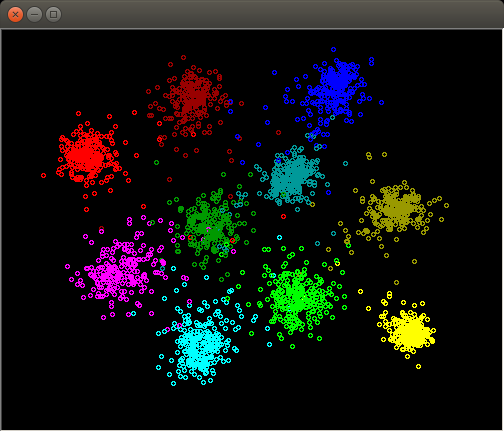

Siamese Network Example
=======================

This repo showcases how to create a Siamese network using the tools provided by
the [*dlib* machine learning library](http://dlib.net/)
([github link](https://github.com/davisking/dlib)). All the layer definition,
training, and testing code is in `main.cpp`.



The image above shows the embedding learned by the Siamese network using this
example. Each plotted circle represents a sample in the test set and the color
is determined the number label (e.g. zeroes are the red circles on the
upper-left).

Requirements
------------

### dlib
* **Minimum Required Version:** 19.0
* **Dependencies**
  * a `C++11`-compatible compiler (`g++`, `clang++`, etc...)
  * `CUDA 7.5`
  * `cuDNN v5`

### CMake
* **Minimum Required Version:** 2.6


Build
-----

In order to build this project, run the following commands at this repo's root
directory.

### Linux
``` bash
    # create a directory to contain all build by-products
    mkdir build
    cd build
    cmake -DDLIB_CMAKE_FILE=$DLIB_ROOT/dlib/cmake ..
    make && make install
```
`$DLIB_ROOT` is the path to the root directory of the *dlib* library.


### Windows
``` bash
    mkdir build
    cd build
    cmake -DDLIB_CMAKE_FILE=$DLIB_ROOT\dlib\cmake ..
    cmake --build . --config release --target install
```


Instructions
------------

After building and installing this project, first download the MNIST dataset by
running `download_mnist.sh`. This script creates a `data` directory and
downloads the dataset into it. Once the MNIST dataset download is completed, go
to the `bin` directory and run the `siamese_network_ex` executable.

In the repo's root directory
``` bash
./download_mnist.sh
cd bin
./siamese_network_ex ../data
```

This program creates two files: `mnist_siamese_network.dat` and
`mnist_siamese_sync`. `mnist_siamese_network.dat` contains the weights of the
neural network model and `mnist_siamese_sync` stores training progress.
